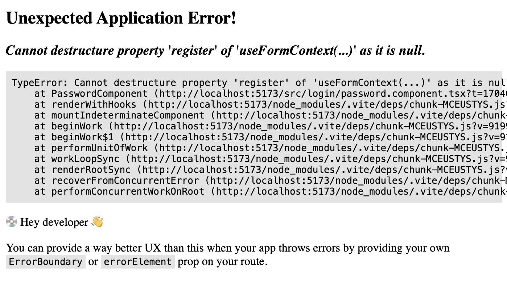
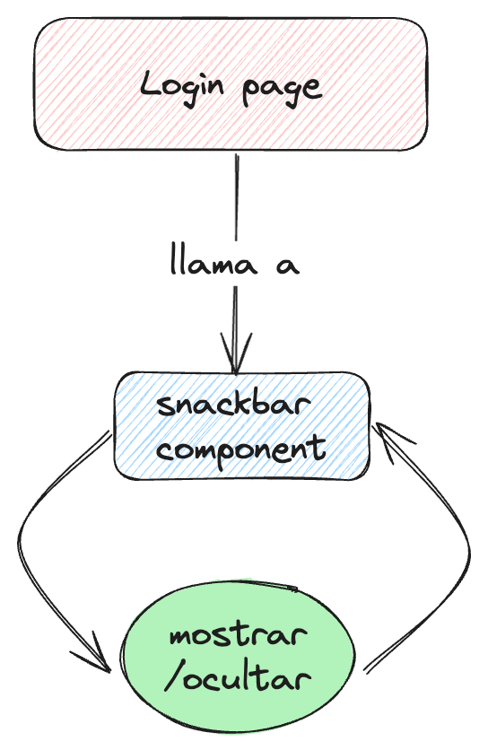
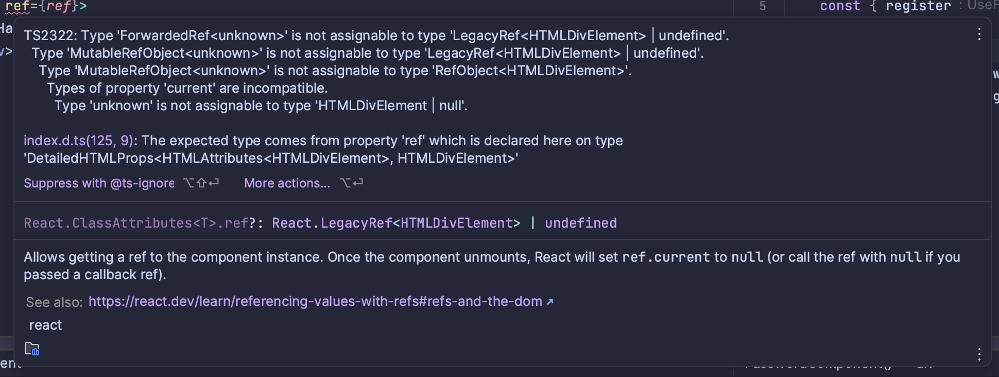
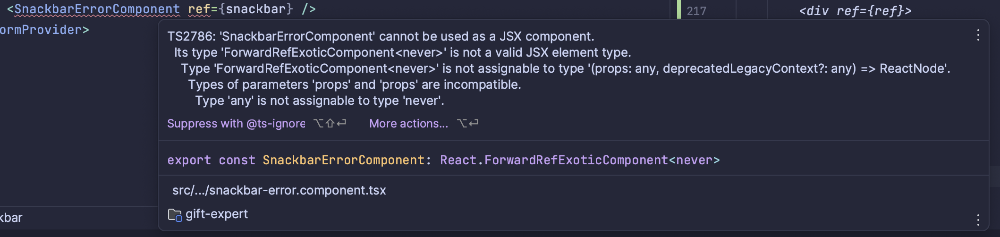
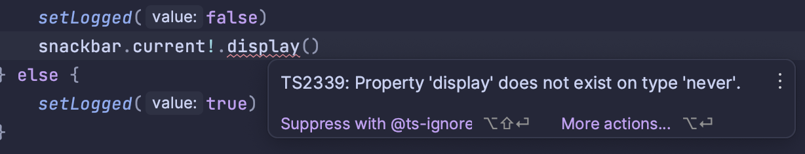

# gift-expert-fhdevtalles


# React hook forms

- Crear una interface/type que utilice posteriormente el hook ``useForm`` para
identificar los campos que formarán parte de su formulario:

```
type FormLogin = {
    username: string,
    password: string
}
```

- Con `useForm<FormLogin>()` definimos los campos de los que se compone nuestro formulario.

- Posteriormente, con ``register`` podremos 'registrar' los controladores de HTML que pertenecen
a nuestro formulario de React:

````
export default function LoginPage(){

    const { register } = useForm<FormLogin>()

    return (
        <>
            <h1> Welcome to login page </h1>
            <input type={'text'} { ...register('username')}/>

        </>
    )
}
````


## ¿Cómo utilizar componentes terceros (propios) y que formen parte del formulario?

### FormProvider + useFormContext

Lo primero de todo es **añadir** ``<FormProvider>`` como padre de uestro form:

```
<FormProvider {...methods}>
            <form onSubmit={handleSubmit((data) => { console.log(data)})}>
                <h1> Welcome to login page </h1>
                <input type={'text'} { ...register('username')}/>
                <PasswordComponent />
                <button> Login </button>
            </form>
        </FormProvider>
```

> ¿Qué es ese methods? Ese methods es el conjunto de las funciones englobadas dentro de useForm:
> 
> ````
> <FormProvider watch={} getValues={} getFieldState={} setError={} clearErrors={} setValue={} trigger={} formState={} resetField={} reset={} handleSubmit={} unregister={} control={} register={} setFocus={} />
> ````
> Como no vamos a escribir todo esto, recurriremos a un atajo.

Ahora, debemos extraer **methods** de nuestro `useForm`:

```const methods = useForm();```


> * Nota: Si tienes ya métodos derivados de _methods_ utilizamos, puedes una pre-desestructuración:
> ````
>  const methods = useForm();
>   const { handleSubmit, register } = methods;
> ````
> Y así no tendrás que sobreescribir nada.

Y eso debemos añadirlo al ``<FormProvider>``:


```jsx

<FormProvider {...methods}>
    <form onSubmit={handleSubmit((data) => { console.log(data)})}>
    <h1> Welcome to login page </h1>
    <input type={'text'} { ...register('username')}/>
    <PasswordComponent />
    <button> Login </button>
    </form>
</FormProvider>
```

Ahora, **dentro de** ``<PasswordComponent />``:

````
export default function PasswordComponent(){

    const { register } = useFormContext()
    return (
        <>
            <label>  Password </label>
            <input {...register('password')} type={'password'}></input>
        </>

    )
}
````

Utilizamos ```useFormContext()```. Al encontrarse el componente **englobado** dentro
de ``FormProvider``, sabe a _qué formulario pertenece_ (de ahí el _context_), así que podemos extraer el mismo método
para registrar un controlador (`password`).


# Posibles errores

## Cannot destructure property register of useFormContext()



Esto ocurre cuando utilizamos ``useFormContext`` en un componente que no está englobado dentro de un
``<FormProvider />``:


`````Bad

export default function LoginPage(){

    const methods = useForm();

    const { handleSubmit, register } = methods;

    return (
            <form onSubmit={handleSubmit((data) => { console.log(data)})}>
                <h1> Welcome to login page </h1>
                <input type={'text'} { ...register('username')}/>
                <PasswordComponent />
                <button> Login </button>
            </form>
    )
}
`````

````Good
export default function LoginPage(){

    const methods = useForm();

    const { handleSubmit, register } = methods;

    return (
        <FormProvider {...methods}>
            <form onSubmit={handleSubmit((data) => { console.log(data)})}>
                <h1> Welcome to login page </h1>
                <input type={'text'} { ...register('username')}/>
                <PasswordComponent />
                <button> Login </button>
            </form>
        </FormProvider>
    )
}

````

# UseRef

## forwardRef

Tenemos el caso de un snackbar que queremos mostrar en caso de que el intento de loguear haya sido fallido:

````
export const SnackbarErrorComponent = () => {
    return (
        <div>
            Ha habido un error
        </div>
    )
})
````


Para ello, desde ``LoginPage`` debemos llamar a ``SnackbarComponent``. 
Primero debemos convertir al componente ``SnackbarComponent`` en un componente al que se pueda acceder por referencia.

Para ello se usa ``formwardRef``:


````
export const SnackbarErrorComponent = forwardRef<HTMLDivElement, null>(function SnackbarErrorComponent(_, ref) {
    return (
        <div ref={ref}>
            Ha habido un error
        </div>
    )
})
````


## Errores

### Type unknown no assignable...



Esto se da por esta circunstancia:

````
export const SnackbarErrorComponent = forwardRef(function SnackbarErrorComponent(_, ref) {
    return (
        <div ref={ref}>
            Ha habido un error
        </div>
    )
})
````

Sin el tipado de ``forwardRef`` no sabe referenciar a _qué_ se está refiriendo.
Se arregla añadiendo ese tipado. Sin embargo, vemos que existen algunas soluciones como esta:

````
export const SnackbarErrorComponent = forwardRef<HTMLDivElement, null>(function SnackbarErrorComponent(_, ref) {
    return (
        <div ref={ref}>
            Ha habido un error
        </div>
    )
})
````

y esto solo causará lo siguiente:



Para arreglarlo, es mejor tener esta estructura:

````
export const SnackbarErrorComponent = forwardRef<HTMLDivElement>((_, ref) => {
    return (
        <div ref={ref} className={styles.snackbar}>
            Ha habido un error
        </div>
    )
})
````


````
<FormProvider {...methods}>
            <form onSubmit={handleSubmit((data) => { login(data)})}>
                <h1> Welcome to login page </h1>
                <label> Username </label>
                <input type={'text'} { ...register('username')}/>
                <PasswordComponent />
                <button> Login </button>
            </form>
            <SnackbarErrorComponent ref={snackbar} />
        </FormProvider>
````

y ``<SnackbarErrorComponent />`` no saldrá en rojo.

> Fuentes: https://stackoverflow.com/questions/74297001/type-mutablerefobjecthtmlinputelement-undefined-is-not-assignable-to-type

### Display does not exist on type never



Es posible que obtengas este error a la hora de usar el elemento ref. Para arreglarlo, basta con añadir a **userRef** como parámetro genérico
aquello que estemos usando (funciones o props):

```
    const snackbar = useRef<{display: () => void}>(null)
```

y se arreglará.

> Nota: es posible que tengas el mismo (o parecido) error en tu componente referido:
> ````
> export const SnackbarErrorComponent = forwardRef<{ display: () => void }>((_, ref) => {
    const snackbarRef = useRef<HTMLDivElement | null>(null);
    useImperativeHandle(ref,() => {
        return {
            display(){
                const snackbar = snackbarRef.current;
                if(snackbar){
                    const isBlock = snackbar.style.display;
                    if(isBlock){
                        snackbar.style.display = 'none'
                    } else {
                        snackbar.style.display = 'block'
                    }
                }
            }
        };
    }, [])
> ````

Si lo tipas de la misma manera que tipaste en la parte anterior, se solucionará el problema.

